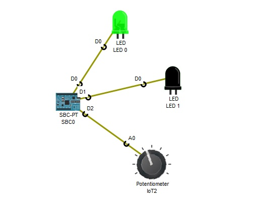
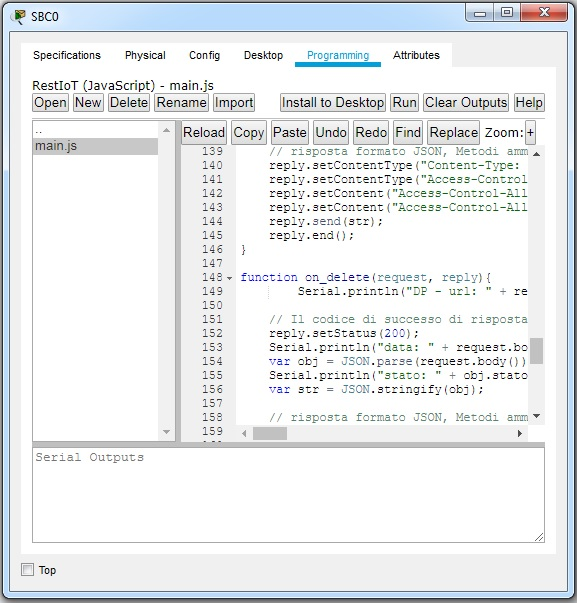

<!DOCTYPE html PUBLIC "-//W3C//DTD HTML 4.01//EN" "http://www.w3.org/TR/html4/strict.dtd">
<html><head>
  
  <meta content="text/html; charset=ISO-8859-1" http-equiv="content-type">
  

  
</head><body>
<h1>Gestione
dipositivi IoT tramite Server Rest in Javascript Packet Tracer</h1>

 

La scheda SBC0 esegue un server Rest
sulla porta nota 8765 per la gestione dei dispositivi collegati.  
 
Ogni risorsa è identificata univocamente da un URI: 
 
1) Il Led 0 è identificato dall'URI http://127.0.0.1:8765/led/0; 
2)  Il Led 1 è identificato
dall'URI http://127.0.0.1:8765/led/1; 

3) Il potenziometro è identificato
dall'URI http://127.0.0.1:8765/potenziometro/2; 

 
Le azioni che consentono di modificare lo stato dei led e di leggere la
tensione sul potenziometro sono: 
 
1) curl -d {\"stato\":\"OFF\"} -H "Content-Type: application/json" -X PUT http://127.0.0.1:8765/led/0 -i&nbsp;&nbsp; (Spegne il Led 0); 
2) curl -d {\"stato\":\"ON\"} -H "Content-Type: application/json" -X PUT http://127.0.0.1:8765/led/0
-i&nbsp;&nbsp;&nbsp;&nbsp; (Accende il Led 0);
 
3)  curl -d {\"stato\":\"OFF\"} -H
"Content-Type: application/json" -X PUT http://127.0.0.1:8765/led/1
-i&nbsp;&nbsp; (Spegne il Led 1); 
4) curl -d {\"stato\":\"ON\"}
-H "Content-Type: application/json" -X PUT http://127.0.0.1:8765/led/0
-i&nbsp;&nbsp;&nbsp;&nbsp; (Accende il Led 1); 
5) curl -d {\"azione\":\"READ\"} -H
"Content-Type: application/json" -X GET
http://127.0.0.1:8765/potenziometro/2 -i&nbsp;&nbsp; (Legge il valore della tensione in uscita
sul potenziometro); 

 
 
 
 
 
 

Per mandare in esecuzione il server:
Scheda Programming -&gt; Progetto RestIot -&gt; main.js tasto Run 

 

 

 

 

 

</body></html>
