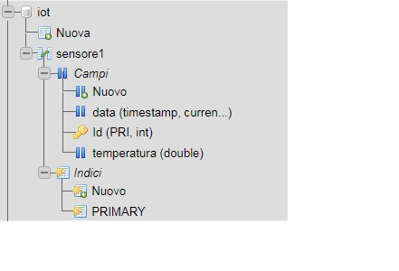

<!DOCTYPE html PUBLIC "-//W3C//DTD HTML 4.01//EN" "http://www.w3.org/TR/html4/strict.dtd">
<html><head>
  
  <meta content="text/html; charset=ISO-8859-1" http-equiv="content-type">

</head><body>

<h1>Client Rest Packet Tracer - Web
Service Php</h1>

In the scenario, the temperature
sensor detects the centigrade degrees of the surrounding environment.
The temperature is set on the thermostat (Alt + left mouse button).  
The SBC card that performs the Javascript sketch detects the
temperature and sends it with an HTTP Post call to the Web Service Php
which takes care of recording the  
data on the "sensor1" table of the Mysql "IoT" database. Data exchange
takes place in Json format. 

 

 

It is necessary to create a database
called "IoT" and a "sensor1" table in the following format 

 

 

Press the Run key in the Programming
menu -&gt; SensoreAttuatore Project -&gt; script main.js 

 

 

 

 

 
Records stored into the table at 5
second intervals 

 

 

 

</body></html>
