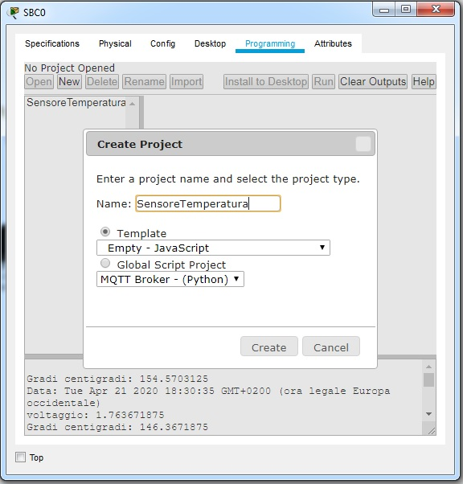
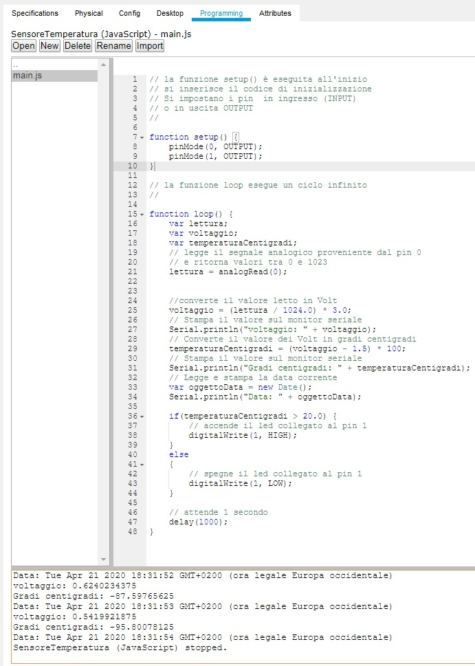

<!DOCTYPE html PUBLIC "-//W3C//DTD HTML 4.01//EN" "http://www.w3.org/TR/html4/strict.dtd">
<html><head>
  
  <meta content="text/html; charset=ISO-8859-1" http-equiv="content-type">

</head><body>

<h1>Programmazione in Javascript di dispositivi IoT con Packet Tracer</h1>

Packet Tracer ha introdotto
funzionalità di IoT (Internet of Things) ed è quindi possibile inserire
smart devices, sensori, attuatori e dispositivi che simulano  
microcontrollori come Arduino e Raspberry Pi. Tutti questi dispositivi
possono essere programmati in Javascript. 
Nello scenario il sensore di temperatura è collegato al pin 0 (D0)
della scheda SBC.  
La funzione analogRead() legge il segnale analogico fornito dal sensore
campionato su valori da 0 a 1023 su una mappatura da -100 ° C a +100 C. 
Il Led è collegato al pin 1 (D1) della scheda SBC. La funzione&nbsp;
digitalWrite() scrive sullo slot digitale (pin D1) il valore ALTO
(HIGH) o BASSO (LOW) 
per accendere o spegnare il led. 
Il Termostato ha la funzione di regolare la temperatura dell'ambiente
che viene rilevata dal sensore di temperatura.  
Può essere impostato premendo contemporaneamente il tasto sinistro del
mouse e il tasto Alt.  
 
 

Per programmare il microcontroller
SBC cliccare con il tasto sinistro del mouse sulla scheda, selezionare
Programming e New e inserire il nome del progetto Javascript. 
 
 
 

 

Nella cartella SensoreTemperatura
così creata inserire il seguente codice nel file main.js 

 

 

 

 

Premendo su tasto Run il programma
rileva la temperatura dell'ambiente impostata dal termostato e stampa i
dati sul monitor seriale. 

 

 

</body></html>
